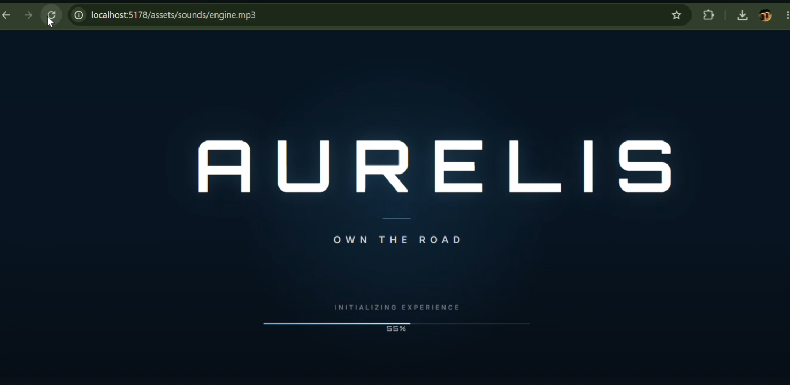
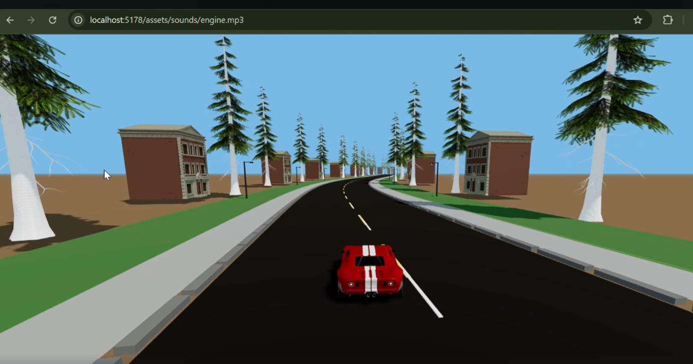

# AURELIS 🏁✨

> AURELIS — an elegant, fast-paced browser racing game built with JavaScript and CSS.

  
   

AURELIS is a small but polished browser racing game emphasizing buttery-smooth controls, responsive visuals, and minimal external dependencies. It’s built using modern JavaScript and handcrafted CSS for animations and effects—perfect for embedding in portfolios, teaching JS game loops, or expanding into a full game.

Highlights
- Lightweight: no frameworks required — pure JS + CSS.
- Smooth animations and responsive layout.
- Easy to extend: add levels, enemies, or local high scores in minutes.

Screenshots
- See the cover image above (replace assets/cover.png with your preferred screenshot or GIF).

Tech Stack
- JavaScript — 62.3%
- CSS — 37.7%
- No build step required (works in static hosting such as GitHub Pages)

Features
- Smooth player controls and physics-lite movement
- Procedural track/obstacle generation (simple and extensible)
- Score tracking and session stats
- Mobile-touch friendly layout (responsive CSS)
- Clean, well-commented source to learn game loop patterns

Play Locally
1. Clone the repository:
   git clone https://github.com/nisha-razzaq/AURELIS.git
   cd AURELIS

2. Open locally (choose one):
   - Quick: open `index.html` in your browser (works for local testing but some browsers restrict local resources).
   - Recommended (local server):
     - Python 3:
       python -m http.server 8000
     - Node (serve):
       npm install -g serve
       serve

Controls
- Desktop:
  - Arrow Left / Arrow Right — steer
  - Arrow Up / W — accelerate
  - Arrow Down / S — brake/reverse
  - Space — boost (if enabled)
- Mobile:
  - On-screen controls (tap / swipe) or tilt (if implemented)

Customization & Extensions
Ideas to expand AURELIS:
- Add player selection and skins (CSS sprite swaps)
- Implement obstacles and collision effects
- Add local leaderboards (localStorage) or a backend scoreboard
- Add sound effects and music (WebAudio API)
- Implement race laps, checkpoints, and power-ups

Development Tips
- Main logic: src/game.js (game loop, input handling)
- Styling: src/styles.css (responsive layout, animations)
- Assets: assets/ (sprites, image)
- Keep animation updates inside requestAnimationFrame for smoothness
- Debounce expensive operations (collision checks) if you scale map complexity

Contributing
Contributions welcome! Please follow these steps:
1. Fork the repo
2. Create a feature branch (feature/your-idea)
3. Make changes and add descriptive commit messages
4. Open a PR with a clear summary and screenshots/GIFs if the change affects visuals

Guidelines:
- Keep changes focused and small
- Include tests or short verification steps where applicable
- Use descriptive variable names and comments for game logic

Roadmap
- [ ] Add sound effects & music toggle
- [ ] Local high-score persistence + UI
- [ ] Additional levels and procedural variety
- [ ] Mobile input improvements and calibration
- [ ] Optional minimap & HUD polish

Known Issues
- Some browsers may restrict local file resource loading; use a local server.
- Performance might drop on older devices — consider optimizing collision checks and drawing layers.

License
This project is available under the MIT License. See LICENSE for details.

Contact
Questions, suggestions, or collaboration ideas? Open an issue or reach out via GitHub: https://github.com/nisha-razzaq

---
